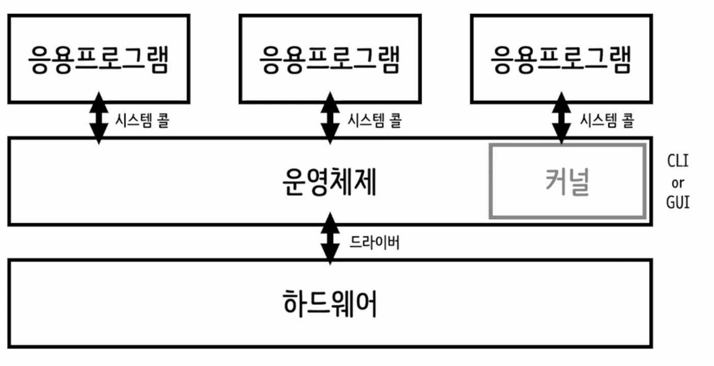

# 운영체제란?

---

사전적 의미 : 운영체제(運營 體制, 문화어: 조작 체계) 또는 오퍼레이팅 시스템(operating system, 약칭: OS)은 사용자의 하드웨어, 시스템 리소스를 제어하고 프로그램에 대한 일반적 서비스를 지원하는 시스템 소프트웨어이다. 컴퓨터 하드웨어를 관리할 뿐 아니라 응용 소프트웨어를 실행하기 위하여 하드웨어 추상화 플랫폼과 공통 시스템 서비스를 제공한다. 최근에는 가상화 기술의 발전에 힘입어 실제 하드웨어가 아닌 하이퍼바이저(가상 머신) 위에서 실행되기도 한다.
~출처 : 위키백과~

---

## 운영체제의 종류
윈도우, 리눅스, 안드로이드, IOS, 등등...  
-> 역할은 다 다르지만 하는일은 같음

결론적으로 컴퓨터에 포함된 CPU나 메모리, 입출력 기기 등이 사용자에 기대에 맞게 역할을 수행할 수 있도록 도와주는 창구 역할을 하는 시스템 소프트웨어다,

---

## 운영체제의 역할
- 프로세스 : 실행된 프로그램 (실행 시키는 순간 프로세스)
- 메모리 : 데이터 저장
- 파일 시스템 관리 : 디렉터리(경로)형태로 파일 관리

---

## 운영체제의 구조

- 커널 : 프로그램이 제공하는 핵심적인 기능(프로세서, 메모리, 저장장리 등..)을 관리  
-> 사용자가 직접 접근 불가 (CLI or GUI 사용)
- CLI (Command Line Interface) : 텍스트 명령어 기반 (cmd)
- GUI (Graphic User Interface) : 바탕화면
- 시스템 콜 : 응용프로그램에 접근할때 안전한 방식으로 하게끔 하는 기능
- 드라이버 : 운영체제가 하드웨어에서 사용할 수 있도록 해주는 기능