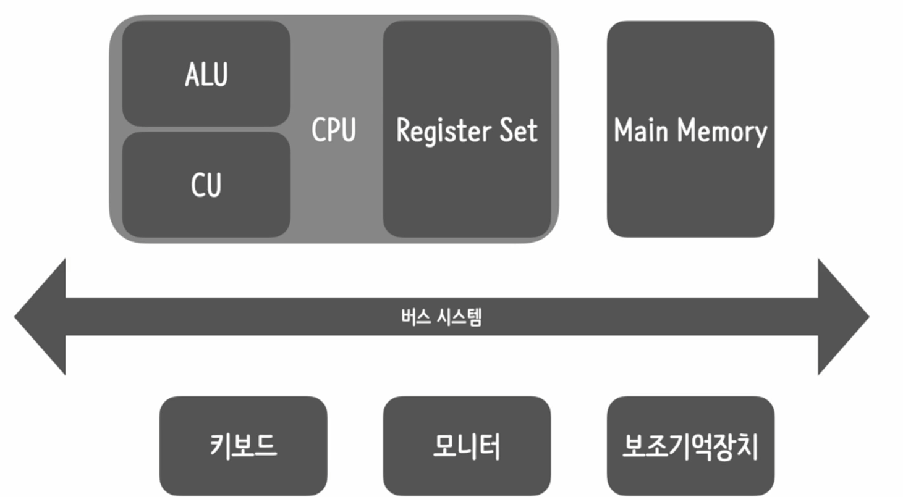

### 컴퓨터 하드웨어 구조

---

---

- CPU ( Centeral Process Unit ) : 컴퓨터 내부에서 주요 연산을 처리 (두뇌역할)
- RAM ( Random Access Memory ) : 프로그램이 실제로 실행되는 영역 -> 프로그램이 프로세스가 되는 순간 메인 메모리에 할당
- BUS System : 컴퓨터를 구성하는 요소들 사이에서 데이터를 주고 받기 위해 사용되는 경로
- - Data Bus
- - Control Bus
- - Address Bus